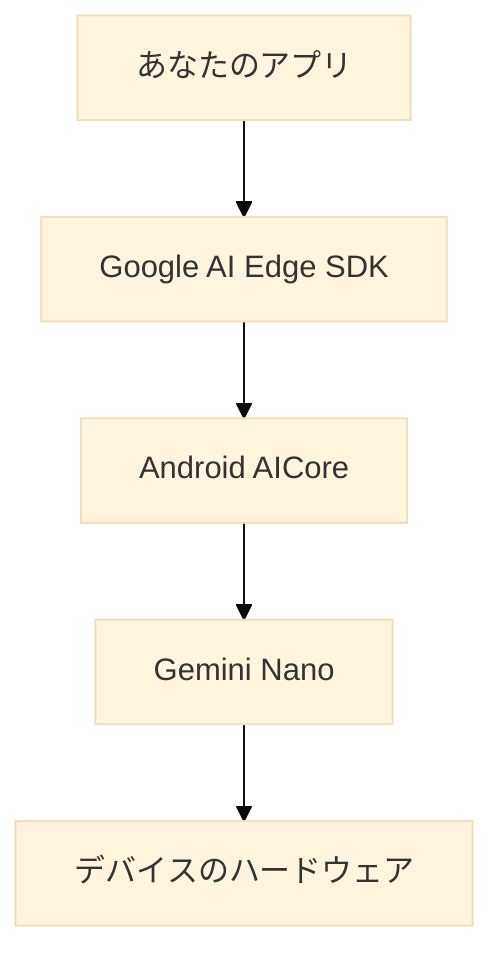
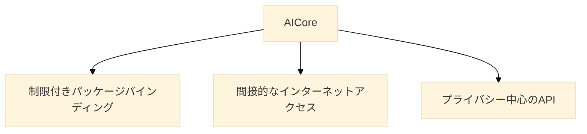
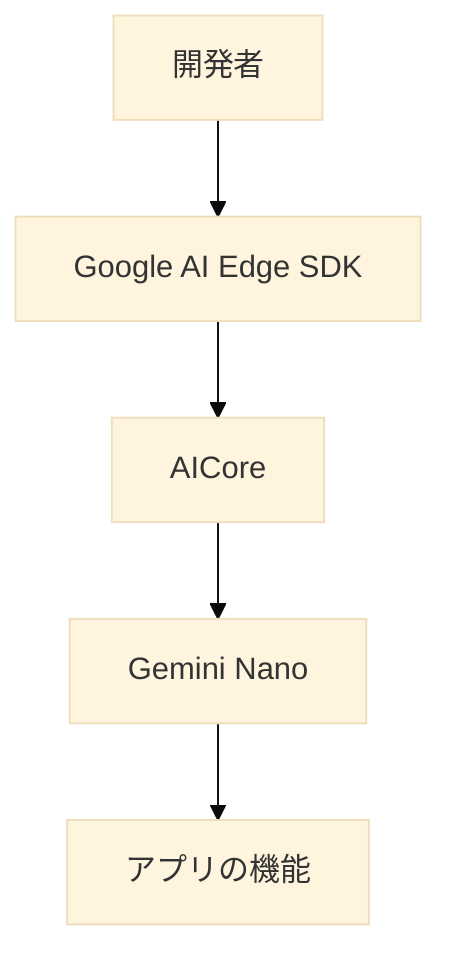

# Android で Gemini Nano を使ってみる

オンデバイス AI の新時代

## はじめに

AndroidスマートフォンでAI機能を活用する新しい方法が登場しました。それが「Gemini Nano」です。この記事では、Gemini Nanoとは何か、どのように使えるのか、そしてなぜ重要なのかを、初心者の方にも分かりやすく解説していきます。

## Gemini Nanoとは？

Gemini Nanoは、GoogleがAndroid向けに開発した小型のAIモデルです。「小型」といっても、その能力は侮れません。大きな特徴は、スマートフォン上で直接動作するということです。

### なぜスマートフォン上で動くAIが重要なの？

1. プライバシーの保護：データをクラウドに送る必要がありません。
2. オフラインでも使える：インターネット接続がなくてもAI機能が使えます。
3. 低遅延：クラウドとのやり取りがないので、応答が速いです。
4. コスト削減：クラウドの使用料がかからないので、開発者にとってはコスト面でメリットがあります。

## Gemini Nanoの仕組み

Gemini Nanoがどのように動作するのか、簡単な図で説明しましょう。

1. あなたのアプリが、Google AI Edge SDKを通じてリクエストを送ります。
2. そのリクエストがAndroid AICoreに渡されます。
3. AICoreがGemini Nanoモデルを使って処理します。
4. 結果がデバイスのハードウェアを使って高速に計算されます。

## Gemini Nanoの特徴

### 1. オンデバイス処理

Gemini Nanoの最大の特徴は、全ての処理がスマートフォン上で行われることです。これにより、以下のようなメリットがあります：

- データのプライバシー保護
- インターネット接続なしでの動作
- 低遅延での応答

### 2. AICore統合

Gemini NanoはAndroidのAICoreシステムサービスと統合されています。これにより：

- デバイスのハードウェアを最大限に活用
- モデルの自動更新
- アプリ開発者の負担軽減

### 3. 安全性

AICoreには複数の安全性機能が組み込まれています：

- 制限付きパッケージバインディング：他のパッケージからの分離
- 間接的なインターネットアクセス：直接のネットワークアクセスを制限
- プライバシー中心のAPI：データ保護を重視

## Gemini Nanoの使用例

Gemini Nanoを使うと、以下のような機能をアプリに追加できます：

1. テキスト要約
2. 質問応答
3. 文章の校正・文法チェック
4. スマートリプライ（文脈に応じた返信候補の提示）
5. 感情分析

例えば、Googleの「Pixel Voice Recorder」アプリでは、Gemini Nanoを使って録音した音声の要約を生成しています。また、GboardではAIを活用したスマートリプライ機能を提供しています。

## 開発者向け情報

Gemini Nanoを使ったアプリ開発に興味がある方向けの情報です：

- 対応デバイス：現在はGoogle Pixel 8 Pro、Pixel 8、Pixel 8a、Samsung S24シリーズで利用可能
- 開発ツール：Google AI Edge SDKを使用
- サポートするモダリティ：現在はテキストのみ（将来的に拡張予定）

## まとめ

Gemini Nanoは、AndroidデバイスでのAI活用に新しい可能性をもたらします。プライバシーを守りながら、高度なAI機能をスマートフォン上で実現できるこの技術は、今後のアプリ開発の方向性を大きく変える可能性があります。

スマートフォンがより「賢く」なることで、私たちの日常生活がどのように変わっていくのか、これからの展開が楽しみですね。

## 参考サイト

https://developer.android.com/ai/aicore

https://ai.google.dev/gemini-api/docs/get-started/android_aicore?hl=ja

